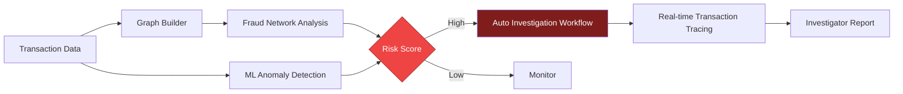
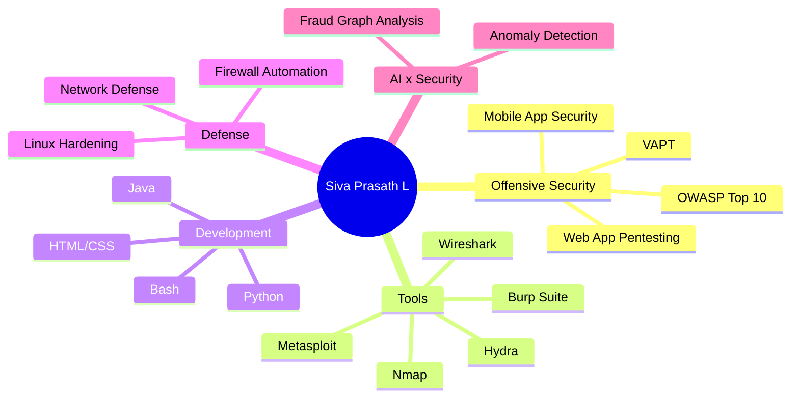

<!-- ===================== ANIMATED HEADER ===================== -->
<p align="center">
  
</p>

<p align="center">
  <a href="https://github.com/sivaprasathl57-ctrl">
    
  </a>
</p>

<p align="center">
  <a href="https://www.linkedin.com/in/siva-prasath-l-b80843344/" target="_blank">
    
  </a>
  <a href="https://sivaprasath.vercel.app" target="_blank">
    
  </a>
  <a href="mailto:sivaprasathl57@gmail.com">
    
  </a>
  <a href="https://github.com/sivaprasathl57-ctrl" target="_blank">
    
  </a>
</p>

<p align="center">
  
</p>

<!-- ===================== ABOUT ===================== -->
<h2 align="center">⚡ About Me</h2>

<p align="center">
  
</p>

<p align="center">
  
</p>

<p align="center">
  Hey! I'm <b>Siva Prasath L</b>, a passionate <b>3rd Year Cyber Security student</b> at <b>Sri Shakthi Institute of Engineering and Technology</b> based in <b>Coimbatore, India</b>.<br /><br />
  🛡️ <b>Cybersecurity professional</b> with a strong focus on ethical hacking and securing web & mobile applications.<br />
  🔍 Work centers on <b>identifying vulnerabilities</b>, understanding real-world attack vectors, and practical remediation.<br />
  📚 Committed to continuous learning in the rapidly evolving cybersecurity landscape.<br />
  ⚖️ Adheres strictly to legal and professional standards.<br />
  🎯 <b>Goal:</b> Help organizations reduce risk, protect user data, and build resilient systems.
</p>

<p align="center">
  
  
  
</p>

<p align="center">
  <b>Philosophy:</b> <i>"The best defense is understanding the offense — finding vulnerabilities before malicious actors do!"</i>
</p>

<!-- ===================== INTERACTIVE: TERMINAL ===================== -->
<h2 align="center">💻 Interactive Terminal</h2>
<p align="center"><sub>👇 Click a command to run it</sub></p>

<details>
<summary><b><code>$ whoami</code></b></summary>

```bash
siva-prasath-l
├── role      : Cybersecurity Student & Ethical Hacker
├── college   : Sri Shakthi Institute of Engineering and Technology
├── location  : Coimbatore, India
├── focus     : VAPT · AppSec · Web & Mobile Security
└── status    : [■■■■■■■■■□] learning... always
```
</details>

<details>
<summary><b><code>$ cat current_goals.txt</code></b></summary>

```text
[x] Master OWASP Top 10
[x] Build a security automation project (Voice-Triggered Firewall)
[x] Build an AI cybercrime investigation platform (NEUROVEIL)
[ ] Land a Security / VAPT internship
[ ] Report valid bug bounty findings
[ ] Earn industry certifications
```
</details>

<details>
<summary><b><code>$ ls ~/interests</code></b></summary>

```text
ethical-hacking/   web-security/   mobile-security/   vapt/
python/            linux/          network-defense/   owasp-top-10/
```
</details>

<details>
<summary><b><code>$ sudo hire --me</code></b> 🔐</summary>

```text
[sudo] password for recruiter: ********
Access granted ✔

Open to: internships · placements · security research · collaboration
Reach me → sivaprasathl57@gmail.com
```
</details>

<!-- ===================== PROJECTS ===================== -->
<h2 align="center">🚀 Featured Project Spotlight</h2>

<table width="100%" border="0" align="center">
  <tr>
    <td align="center" style="padding: 22px;">
      <h3>NEUROVEIL — Cybercrime Investigation AI</h3>
      <p><i>An advanced AI-powered investigation system featuring graph-based fraud network analysis, ML anomaly detection, automated investigation workflows, and real-time transaction tracing to help organizations mitigate cyber risks.</i></p>
      <br />
      <p>
        <a href="https://sivaprasath.vercel.app" target="_blank">
          
        </a>
        <a href="https://github.com/sivaprasathl57-ctrl/NEUROVEIL" target="_blank">
          
        </a>
      </p>
    </td>
  </tr>
</table>

<details>
<summary><b>🔎 Click to explore the NEUROVEIL pipeline</b></summary>


</details>

<table width="100%" border="0" align="center">
  <tr>
    <td width="50%" align="center" style="padding: 14px;">
      <h4>🛡️ Security Automation</h4>
      <p>
        <a href="https://github.com/sivaprasathl57-ctrl/Voice-Triggered-Firewall-Control" target="_blank"><b>Voice-Triggered Firewall</b></a><br />
        <sub>Linux Security & Automation</sub>
      </p>
    </td>
    <td width="50%" align="center" style="padding: 14px;">
      <h4>🔍 Active Deep Dives</h4>
      <p>
        <b>VAPT & Vulnerability Remediation</b><br />
        <sub>Ethical Hacking & Penetration Testing</sub>
      </p>
    </td>
  </tr>
</table>

<!-- ===================== SKILLS ===================== -->
<h2 align="center">🧰 Tech Stack & Arsenal</h2>

<p align="center">
  
</p>

<p align="center"><b>Programming & Frontend</b></p>
<p align="center">
  <a href="https://skillicons.dev"></a>
</p>

<p align="center"><b>Database Systems</b></p>
<p align="center">
  <a href="https://skillicons.dev"></a>
</p>

<p align="center"><b>Operating System & Environment</b></p>
<p align="center">
  <a href="https://skillicons.dev"></a>
</p>

<details open>
<summary><b>🕵️ Cybersecurity & Penetration Testing Tools (click to collapse)</b></summary>
<br />
<p align="center">
  
  
  
  
  
  
</p>
</details>

<details>
<summary><b>🗺️ Click to view my skill map</b></summary>


</details>

<!-- ===================== STATS ===================== -->
<h2 align="center">📊 GitHub Analytics & Activity</h2>

<p align="center">
  
  
</p>

<p align="center">
  
</p>

<details>
<summary><b>📈 Click to view animated activity graph</b></summary>
<p align="center">
  
</p>
</details>

<details>
<summary><b>🏆 Click to view trophies</b></summary>
<p align="center">
  
</p>
</details>

<p align="center">
  
</p>

<h2 align="center">🐍 Contribution Journey</h2>

<p align="center">
  
</p>

<!-- ===================== CONNECT ===================== -->
<h2 align="center">🤝 Let's Connect & Collaborate</h2>

<p align="center">
  
</p>

<table border="0" align="center">
  <tr>
    <td align="center" width="220" style="padding: 16px;">
      <a href="https://www.linkedin.com/in/siva-prasath-l-b80843344/" target="_blank">
        
        <br /><br />
        
      </a>
      <br />
      <sub><b>Professional Network</b></sub>
    </td>
    <td align="center" width="220" style="padding: 16px;">
      <a href="https://sivaprasath.vercel.app" target="_blank">
        
        <br /><br />
        
      </a>
      <br />
      <sub><b>Personal Portfolio</b></sub>
    </td>
    <td align="center" width="220" style="padding: 16px;">
      <a href="mailto:sivaprasathl57@gmail.com">
        
        <br /><br />
        
      </a>
      <br />
      <sub><b>Direct Inquiries</b></sub>
    </td>
  </tr>
</table>

<!-- ===================== ANIMATED FOOTER ===================== -->
<p align="center">
  
</p>
