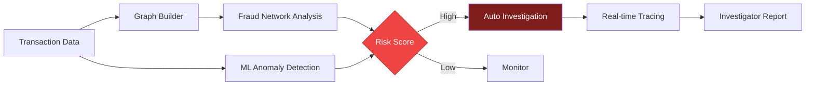
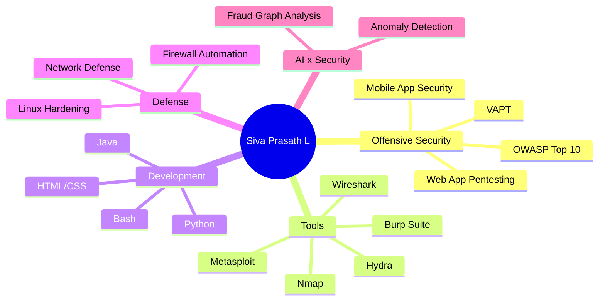

<!-- ============ HEADER (animated: matrix rain · glitch title · radar) ============ -->
<p align="center">
  
</p>

<p align="center">
  <a href="https://github.com/sivaprasathl57-ctrl">
    
  </a>
</p>

<p align="center">
  <a href="https://www.linkedin.com/in/siva-prasath-l-b80843344/"></a>
  <a href="https://sivaprasath.vercel.app"></a>
  <a href="mailto:sivaprasathl57@gmail.com"></a>
  <a href="https://github.com/sivaprasathl57-ctrl"></a>
  
</p>


<!-- ============ ABOUT ============ -->
<h2 align="center">⚡ About Me</h2>

<p align="center">
  
</p>

<p align="center">
  Hey! I'm <b>Siva Prasath L</b>, a <b>3rd Year Cyber Security student</b> at <b>Sri Shakthi Institute of Engineering and Technology</b>, Coimbatore, India.<br />
  🛡️ Ethical hacking & securing <b>web / mobile apps</b> &nbsp;·&nbsp; 🔍 Finding vulnerabilities & real-world attack vectors<br />
  📚 Always learning &nbsp;·&nbsp; ⚖️ Legal & professional standards only &nbsp;·&nbsp; 🎯 Helping orgs reduce risk & protect user data
</p>

<p align="center">
  
  
  
</p>

<p align="center">
  
</p>

<!-- ============ INTERACTIVE TERMINAL ============ -->
<h2 align="center">💻 Interactive Terminal</h2>
<p align="center"><sub>👇 click a command to run it</sub></p>

<details>
<summary><b><code>$ whoami</code></b></summary>

```bash
siva-prasath-l
├── role      : Cybersecurity Student & Ethical Hacker
├── college   : Sri Shakthi Institute of Engineering and Technology
├── location  : Coimbatore, India
├── focus     : VAPT · AppSec · Web & Mobile Security
└── status    : [■■■■■■■■■□] learning... always
```
</details>

<details>
<summary><b><code>$ cat current_goals.txt</code></b></summary>

```text
[x] Master OWASP Top 10
[x] Build a security automation project (Voice-Triggered Firewall)
[x] Build an AI cybercrime investigation platform (NEUROVEIL)
[ ] Land a Security / VAPT internship
[ ] Report valid bug bounty findings
[ ] Earn industry certifications
```
</details>

<details>
<summary><b><code>$ nmap -sV --script skills localhost</code></b></summary>

```text
PORT      STATE  SERVICE            VERSION
22/tcp    open   ethical-hacking    advanced-beginner → pro
80/tcp    open   web-app-security   OWASP Top 10
443/tcp   open   mobile-security    Android / API testing
8080/tcp  open   vapt               recon → exploit → report
5000/tcp  open   python-automation  scripts, tooling, ML
9999/tcp  open   linux              Kali · Bash · Hardening
```
</details>

<details>
<summary><b><code>$ sudo hire --me</code></b> 🔐</summary>

```text
[sudo] password for recruiter: ********
Access granted ✔
Open to: internships · placements · security research · collaboration
Reach me → sivaprasathl57@gmail.com
```
</details>


<!-- ============ PROJECTS ============ -->
<h2 align="center">🚀 Projects</h2>

<table align="center" width="100%">
  <tr>
    <td align="center" width="50%">
      <h4>🧠 NEUROVEIL</h4>
      <sub><i>Cybercrime investigation AI — graph-based fraud network analysis, ML anomaly detection, automated workflows & real-time transaction tracing.</i></sub><br /><br />
      <a href="https://github.com/sivaprasathl57-ctrl/NEUROVEIL"></a>
      <a href="https://sivaprasath.vercel.app"></a>
    </td>
    <td align="center" width="50%">
      <h4>🎙️ Voice-Triggered Firewall</h4>
      <sub><i>Linux security & automation — control firewall rules with voice commands.</i></sub><br /><br />
      <a href="https://github.com/sivaprasathl57-ctrl/Voice-Triggered-Firewall-Control"></a>
    </td>
  </tr>
</table>

<details>
<summary><b>🔎 Click to explore the NEUROVEIL pipeline</b></summary>


</details>

<!-- ============ SKILLS ============ -->
<h2 align="center">🧰 Tech Stack & Arsenal</h2>

<p align="center">
  
</p>

<p align="center">
  
</p>

<p align="center">
  
  
  
  
  
  
</p>

<details>
<summary><b>🗺️ Click to view my skill map</b></summary>


</details>


<!-- ============ STATS ============ -->
<h2 align="center">📊 GitHub Analytics</h2>

<p align="center">
  
  
</p>

<p align="center">
  
</p>

<details>
<summary><b>📈 Click for activity graph</b></summary>
<p align="center">
  
</p>
</details>

<details>
<summary><b>🏆 Click for trophies</b></summary>
<p align="center">
  
</p>
</details>

<h2 align="center">🐍 Contribution Journey</h2>
<p align="center">
  
</p>


<!-- ============ CONNECT ============ -->
<h2 align="center">🤝 Let's Connect</h2>

<p align="center">
  
</p>

<p align="center">
  <a href="https://www.linkedin.com/in/siva-prasath-l-b80843344/"></a>&nbsp;&nbsp;&nbsp;
  <a href="https://sivaprasath.vercel.app"></a>&nbsp;&nbsp;&nbsp;
  <a href="mailto:sivaprasathl57@gmail.com"></a>&nbsp;&nbsp;&nbsp;
  <a href="https://github.com/sivaprasathl57-ctrl"></a>
</p>

<!-- ============ FOOTER (animated waves) ============ -->
<p align="center">
  
</p>
